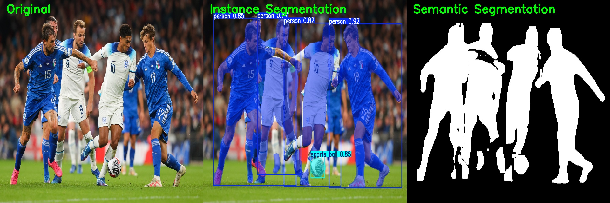
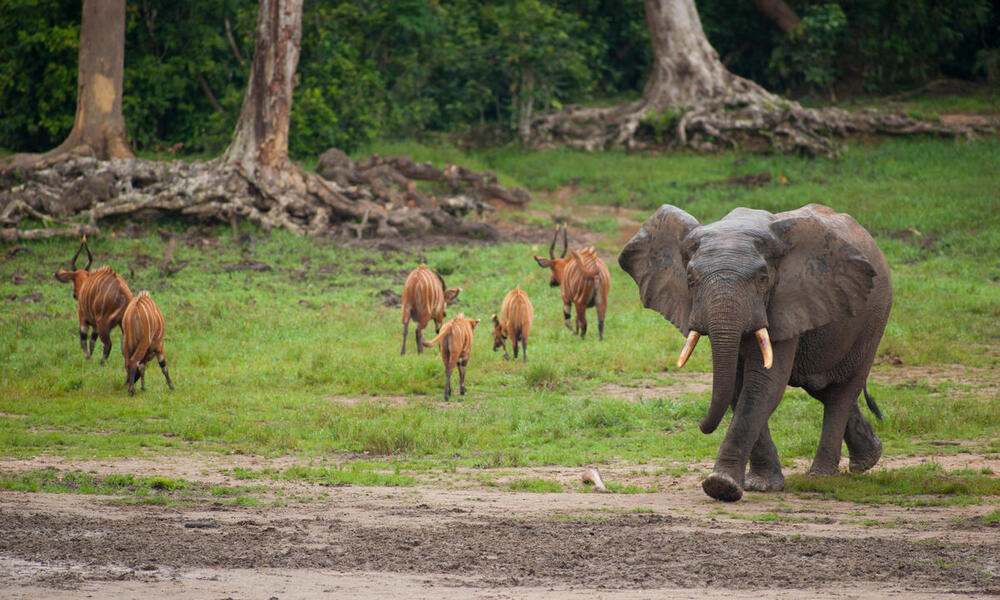
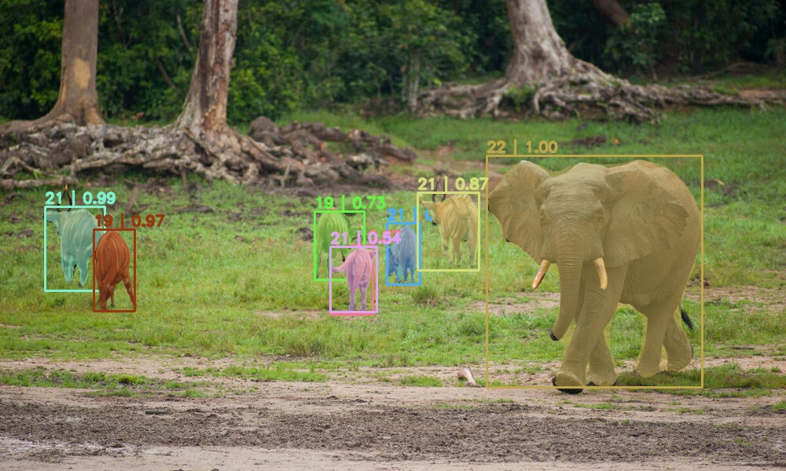

## YOLOv8 Instance ve Semantic Segmentation Karşılaştırması

Bu proje, YOLOv8 segmentasyon modelini kullanarak bir görüntü üzerinde hem **instance segmentation** hem de **semantic segmentation** çıktılarının üretilmesini sağlar.  
Çıktılar, orijinal görüntü ile birlikte yan yana gösterilir.

## Kullanılan Görsel

## Output

## MASK RCNN ile Segmentasyon 
Önceden eğitilmiş R-CNN modeliyle segmentasyon işlemi yapılmıştır.
## Kullanılan Görsel

## Output
