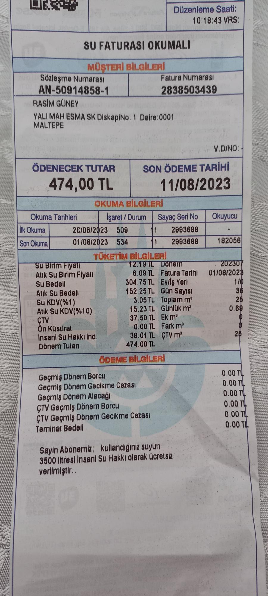

# Fatura Okuma (OCR) Projesi
Bu proje, Python, OpenCV ve Tesseract OCR kullanarak su, elektrik ve doğalgaz 
faturalarından otomatik olarak bilgi çıkarmak için geliştirilmiştir. 
Görüntü işleme teknikleri ile fatura görüntüleri optimize edilir ve
ardından metin analizi ile istenen veriler ayıklanır.

##  Kurulum ve Gereksinimler

### 1. Tesseract OCR
Bu projenin çalışması için sisteminizde Tesseract OCR motorunun kurulu olması gerekmektedir. Kurulum talimatları için Tesseract GitHub sayfasını ziyaret edebilirsiniz.

### 2. Python Kütüphaneleri
Gerekli Python kütüphanelerini aşağıdaki komutla kurabilirsiniz:
```bash
pip install pytesseract opencv-python Pillow 
```
> Görseller eğitim sürecinde `images/` klasörü altında organize edilmiştir.

---



```text
-------- FATURA BİLGİLERİ -------
Tür: Su Faturası
Ödenecek Tutar: 474,00 TL
Son Ödeme Tarihi: 11/08/2023
Geçmiş Dönem Borcu: 0,00 TL
-------------------------------------