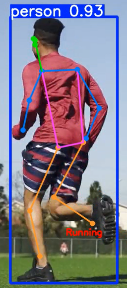
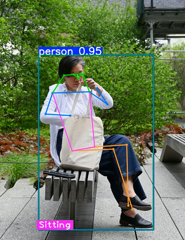
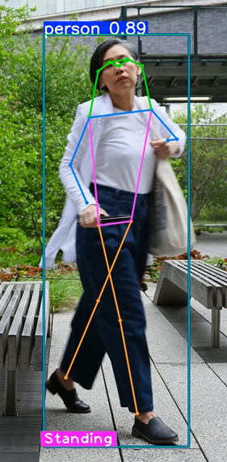

# YOLOV8 Modeli ile insan pose tahmini

Bu proje, hazır yolov8 modeliyle çalışılmıştır. Örnek videolar üzerinden insan postür tahmini yapılması amaçlanmıştır.

> Örnek olarak kullanılan videolar  `videos/` klasöründe sonuçları ise `results/` klasörleri altında organize edilmiştir.

---
> Aşağıdaki ekran görüntüleri örnek videolar içinden alınmıştır. Projede görseller üzerinden de sonuç alınabilir.
## Ekran Görüntüleri
### Koşma postürü için sonuç:

### Oturma postürü için sonuç:

### Ayakta postürü için sonuç:

