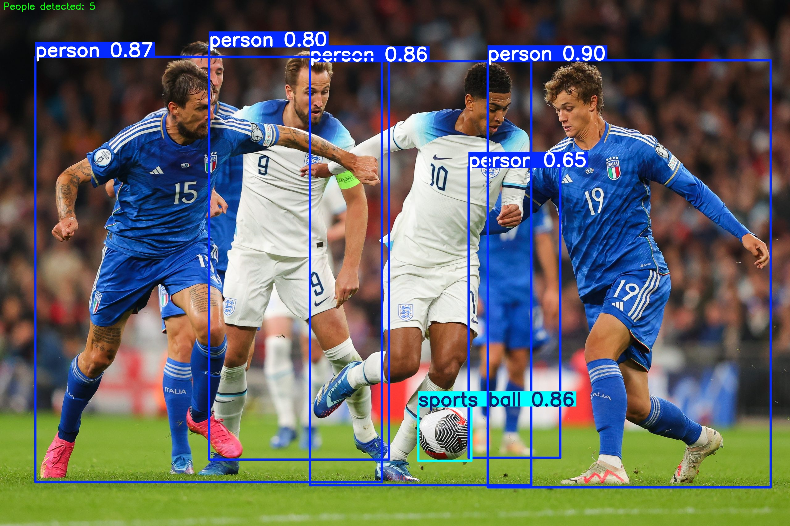

# YOLOV8 Modeli ile insan tespiti ve sayımı

Bu projede, futbol.pt adında özel eğitilmiş bir model kullanılmaktadır. Bu modelde futbolcu, top ve hakem tespiti yapılabiliyor.
Ek olarak tespit edilen futbolcuların sayımı da çkıktı olarak verilmektedir.

> Görseller eğitim sürecinde `images/` ve `results/` klasörleri altında organize edilmiştir.

---

## Ekran Görüntüleri
### Örnek olarak kullanılan görsel:

### Çıktı sonucu:

